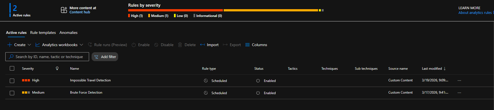
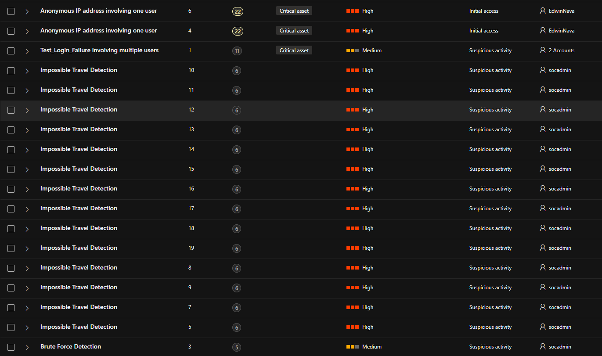
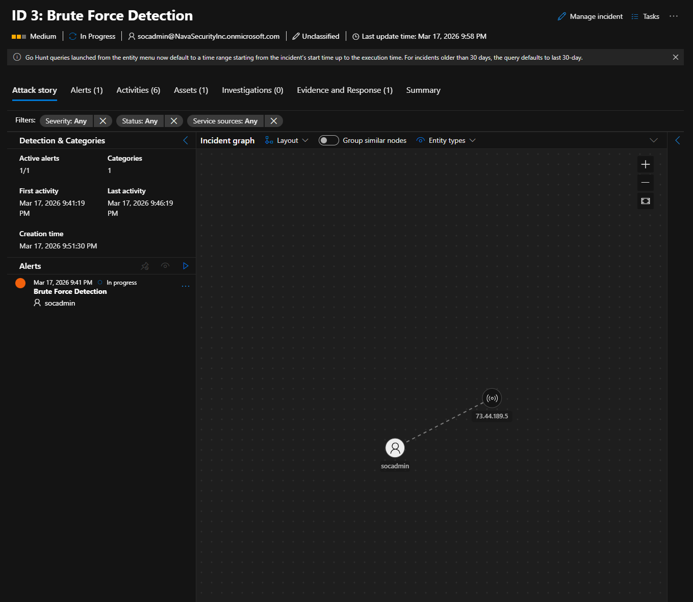
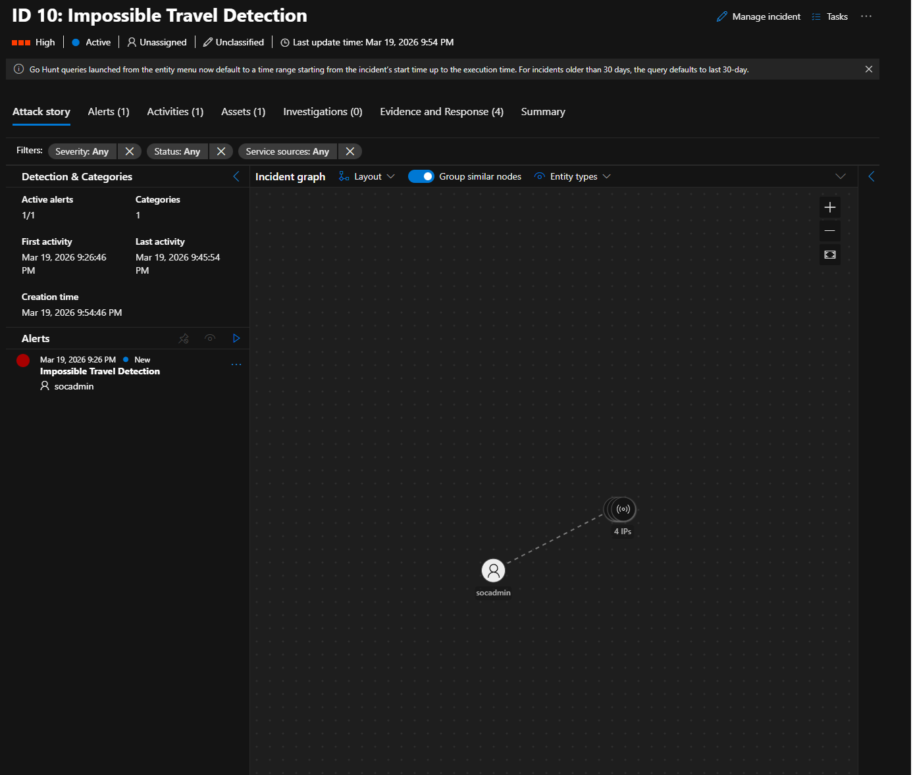
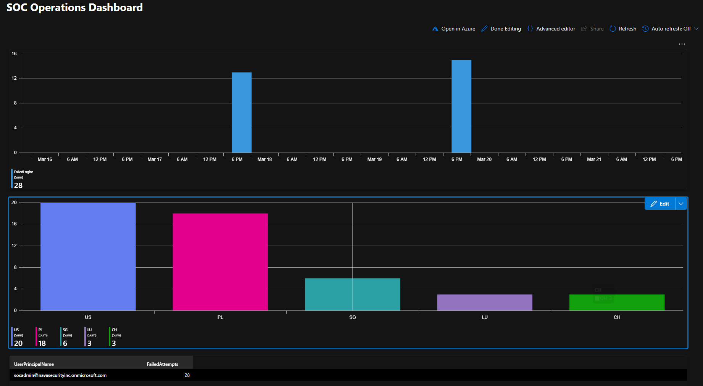
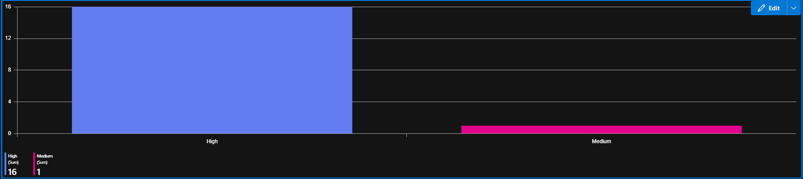

# Microsoft Sentinel SOC Lab

A cloud-based Security Operations Center (SOC) simulation built on Microsoft Sentinel, demonstrating detection engineering, incident response, and security monitoring using real identity telemetry from Microsoft Entra ID.

---

## Project Overview

This project simulates how a real SOC operates — from log ingestion and custom detection rule creation through to incident investigation and dashboard reporting. All detections were validated using simulated attack activity against a live Azure tenant.

**Skills demonstrated:**
- SIEM deployment and configuration
- Detection engineering with KQL (Kusto Query Language)
- Incident investigation and entity correlation
- Attack simulation (brute force, impossible travel)
- SOC dashboard creation with Sentinel Workbooks

---

## Environment

| Component | Details |
|-----------|---------|
| SIEM Platform | Microsoft Sentinel |
| Identity Provider | Microsoft Entra ID (P2) |
| Log Analytics Workspace | soc-law-edwin (East US) |
| Log Types Ingested | SigninLogs, AuditLogs, SecurityAlert |
| Tenant | Nava Security Inc |

---

## Detections Built

### 1. Brute Force Login Detection
**Severity:** Medium  
**Logic:** Detects 5 or more failed authentication attempts (result code 50126) from the same IP address against the same account within a 5-minute window.

```kql
SigninLogs
| where TimeGenerated > ago(5m)
| where ResultType == 50126
| summarize FailedAttempts = count() by IPAddress, UserPrincipalName
| where FailedAttempts >= 5
```

| Setting | Value |
|---------|-------|
| Run frequency | Every 5 minutes |
| Lookback window | 5 minutes |
| Alert threshold | Greater than 0 results |
| Entity mapping | Account → UserPrincipalName, IP → IPAddress |
| Incident creation | Enabled |

---

### 2. Impossible Travel Detection
**Severity:** High  
**Logic:** Detects successful logins from the same account originating from different geographic locations within a 60-minute window — a pattern inconsistent with physical travel and commonly associated with credential compromise.

```kql
let timeframe = 1h;
SigninLogs
| where TimeGenerated > ago(timeframe)
| where ResultType == 0
| project UserPrincipalName, TimeGenerated, IPAddress, Location
| sort by UserPrincipalName asc, TimeGenerated asc
| extend prevTime = prev(TimeGenerated), prevIP = prev(IPAddress), prevLocation = prev(Location)
| where UserPrincipalName == prev(UserPrincipalName)
| extend timeDiff = datetime_diff("minute", TimeGenerated, prevTime)
| where timeDiff between (1 .. 60)
| where IPAddress != prevIP
| where Location != prevLocation
```

| Setting | Value |
|---------|-------|
| Run frequency | Every 5 minutes |
| Lookback window | 1 hour |
| Alert threshold | Greater than 0 results |
| Entity mapping | Account → UserPrincipalName, IP → IPAddress |
| Incident creation | Enabled |

---

## Analytics Rules

Both rules deployed as custom scheduled analytics rules with entity mapping and automated incident creation enabled.



---

## Attack Simulation

### Brute Force Simulation
Failed login attempts were generated using an incognito browser session against the socadmin account. Attempts were logged under Entra ID result code 50126 and picked up by the detection rule within one run cycle.

### Impossible Travel Simulation
Sequential logins were generated from geographically distant locations within minutes of each other using Proton VPN and Tor Browser:

| Session | Location | Result Code |
|---------|----------|-------------|
| Baseline | United States | 0 (Success) |
| VPN | Singapore | 0 (Success) |
| Tor | Poland | 0 (Success) |
| VPN | Netherlands | 0 (Success) |

---

## Incidents Generated

Both custom detection rules fired and generated incidents in Sentinel. Additionally, Microsoft Defender's built-in threat intelligence automatically flagged the VPN and Tor logins as Anonymous IP address events — demonstrating that the simulation activity generated real security signals across multiple detection layers.



### Brute Force Incident
Incident graph showing the socadmin account linked to the attacking IP address (73.44.189.5). Activities tab recorded 6 alert events across the detection window.



### Impossible Travel Incident
Incident graph showing the socadmin account connected to 4 distinct IP addresses from different countries — all within a 19-minute window (9:26 PM to 9:45 PM on March 19, 2026).



---

## SOC Operations Dashboard

Built using Microsoft Sentinel Workbooks. Covers the four core visibility areas a SOC analyst monitors daily.




| Tile | Description |
|------|-------------|
| Failed Logins Over Time | Bar chart showing hourly failed login volume. Two clear spikes on March 17 and March 19 correspond to brute force simulation sessions. |
| Login Locations by Country | Successful login distribution across countries: US (20), PL (18), SG (6), LU (3), CH (3). Reflects both baseline and VPN/Tor simulation activity. |
| Top Targeted Users | Grid showing accounts with the most failed attempts. socadmin recorded 28 total failed attempts. |
| Alert Severity Breakdown | 16 High severity alerts (Impossible Travel) and 1 Medium severity alert (Brute Force). |

---

## Key Learnings

**Log ingestion pipeline validation** — SigninLogs required Entra ID P2 licensing to flow into Sentinel. Without it the connector appeared configured but no data was received, requiring active troubleshooting to identify the silent failure.

**Detection window tuning** — The initial brute force rule used a 5-minute lookback but failed to trigger because attack attempts spanned a longer window. Understanding the relationship between query window and rule schedule frequency is critical for reliable detection.

**UI time picker override** — Sentinel's time range picker overrides KQL time filters. Queries returning zero results in the rule editor were valid — the UI filter was excluding the relevant data range.

**Geo data limitations** — LocationDetails.geoCoordinates fields were null for most sign-in events, preventing map visualization. This reflects a real environment constraint where not all telemetry fields are consistently populated.

**Identity incident response** — A lost MFA device on the primary admin account required creating a secondary Global Admin to recover tenant access — a real-world identity incident response scenario.

---

## Repository Structure

```
microsoft-sentinel-soc-lab/
├── README.md
├── Detections/
│   ├── brute-force-detection.kql
│   └── impossible-travel-detection.kql
├── Screenshots/
│   ├── AnalyticRules.png
│   ├── BruteForceDetails.png
│   ├── ImpossibleTravelDetails.png
│   ├── Incident_Detection.png
│   ├── SOCDash_1.png
│   └── SocDash_2.png
└── Documentation/
    └── Sentinel_SOC_Project_Edwin_Nava.docx
```

---

## Certifications

- Microsoft SC-200: Microsoft Security Operations Analyst
- Microsoft SC-900: Microsoft Security, Compliance, and Identity Fundamentals
- CompTIA Security+

---

## Connect

**Edwin Nava**  
Aspiring Cloud Security Engineer  
[LinkedIn](https://www.linkedin.com/in/edwinnava29/)
